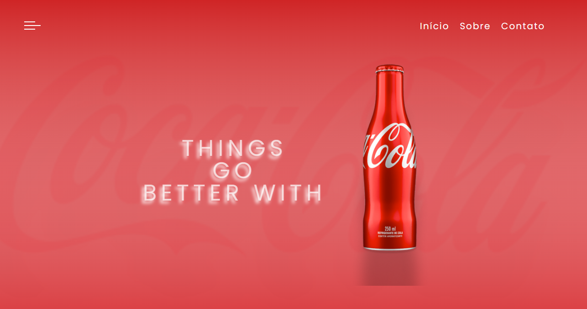

<h1 align="center">Coca Cola</h1>

  <a href="#-screenshots">Screenshots</a>&nbsp;&nbsp;&nbsp;|&nbsp;&nbsp;&nbsp;
  <a href="#-stack-utilizada">Stack utilizada</a>&nbsp;&nbsp;&nbsp;|&nbsp;&nbsp;&nbsp;
  <a href="#-como-usar">Como Usar</a>&nbsp;&nbsp;&nbsp;|&nbsp;&nbsp;&nbsp;
  <a href="#-autor">Autor</a>&nbsp;&nbsp;&nbsp;|&nbsp;&nbsp;&nbsp;
  <a href="#memo-licença">Licença</a>

  

Este é um simples exemplo de página responsiva usando HTML e CSS.

<h2>
    <a id="-screenshots">Screenshots</a>
</h2>

    

<h2>
    <a id="-stack-utilizada">Stack utilizada</a>
</h2>

**Front-end:** HTML, CSS , Figma

<h2>
    <a id="-como-usar">Como Usar</a>
</h2>

* Clone o repositório ou faça o download dos arquivos.
* Abra o arquivo index.html em seu navegador.
* Pronto! Você já pode visualizar a página de login.

<h2>
    <a id="-autor">Autor</a>
</h2>

Esta página foi criada por Damara Santos para fins educacionais.

<h2>
    <a id="memo-licença">Licença</a>
</h2>

Este projeto está sob a licença [MIT](https://choosealicense.com/licenses/mit/)
